# Rust'ı Ne Kadar İyi Biliyoruz?

Bir dili iyi bildiğinize nasıl karar verirsiniz? Çeşitli algoritma sorularını çözerek, zorlu projeler yazarak veya... Rust zaten öğrenme eğrisi oldukça yüksek olan bir dil. En azından başlarda bazı yaklaşımlarını anlamak güç. İlk aklıma gelenler `**Ownership**, **Borrow Checkler**, **Lifetimes**, **Macros** gibi konular. Bu kavramları aştığımız takdirde ilerlemek oldukça kolay ama yine de gerçekten dilin yeteneklerini ne kadar iyi bildiğimize dair bir ölçü değil. Bu nedenle bir süredir çeşitli kaynaklardan *(Internet siteleri olmak üzere)* dilin bizi afallatacak soruları ile ilgili araştırmalar yapıyorum. Çok basit görünen ama bazen dakikalarca baktığım ve çözemediğim sayısız kod parçası ile karşılaştım. Tüm bunların derlenip toplanması ve bir başlık altında kaleme alınması gerekiyordu. İşte bu dokümanın amacı tam olarak bu.

- [Scope Kavramı ve Ignore Binding Meselesi](#scope-kavramı-ve-ignore-binding-meselesi-adventure_00)
- [Her Const Kullanımı Yeni Bir Geçici Kopya Demek mi?](#her-const-kullanımı-yeni-bir-geçici-kopya-demek-mi-adventure_01)
- [Zero Sized Types ve Assignment Expression ile Unit Type İlişkisi](#zero-sized-types-ve-assignment-expression-ile-unit-type-i̇lişkisi-adventure_02)
- [let-binding Senaryolarında Yaşam Süreleri](#let-binding-senaryolarında-yaşam-süreleri-adventure_03)
- [Birden Fazla Mutable Referansta Israr Etmek](#birden-fazla-mutable-referansta-israr-etmek-adventure_04)

## Scope Kavramı ve Ignore Binding Meselesi (adventure_00)

Rust'ta değişkenlerin yaşam süreleri önemli bir konu. Bir C# programcısı bu yaşam ömrünün .Net dünyasında **Garbage Collector** tarafından yönetildiğini bilir ve hatta değişkenler **scope** dışına çıktıklarında anında olmasa bile GC'nin radarına girerek gerektiğinde bellekten düşürülür. Rust dilinde de benzer şekilde scope kullanımı değişkenlerin yaşam ömürleri için belirleyici kriterlerdendir ancak yine biliriz ki Rust dilinde Garbage Collector gibi bir mekanizma yoktur fakat tüm kurallar belleği en yüksek seviyede güvenli kılabilmemizi garanti eder. Artık referanslar, unutulan referanslar, hayalet referanslar vs oluşmaz.

C# tarafında, **IDisposable** arayüzünü implemente eden bir referans nesne *(ki çoğu eder)* scope dışına çıktığında otomatik olarak **Dispose** metodu işletilir ve bazı kaynak temizleme işleri icra edilir. Rust dilinde buna benzer davranışı tanımlayan **Drop** isimli bir **trait** mevcuttur. Bu trait'i uyarlayan bir referans değişken scope dışında kaldığında uyguladığı **drop** fonksiyonu çağrılır. Zaten birçok dahili veri türü bu trait'i uygular. Ancak değişken atamalarında dikkate değer bir durum söz konusudur. Bazen bir referans türü değere bağlanmaz *(Ignore the Binding terimini nasıl ifade edebilirim bilemedim)* Konuyu biraz daha iyi anlayabilmek için örnek kodlara başvuralım.

İlk olarak temelleri biraz hatırlayalım.

```rust
fn main() {
    {
        let name = "Burak".to_string();
        println!("Hello, {}", name);
    }
    println!("How are you? {}", name);
}
```

Program kodunda yer alan **name** isimli değişken bir scope içinde tanımlanmıştır. Dolayısıyla kodun akan kısmında erişilebilir değildir. Bu yüzden derleme zamanında bir hata alırız.

```text
error[E0425]: cannot find value `name` in this scope
 --> adventure_00\src\main.rs:6:33
  |
6 |     println!("How are you? {}", name);
  |                                 ^^^^
  |
help: the binding `name` is available in a different scope in the same function
 --> adventure_00\src\main.rs:3:13
  |
3 |         let name = "Burak".to_string();
  |             ^^^^
```

Burada stack odaklı bir veri türü kullanmak da bir şeyi değiştirmez.

```rust
fn main() {
    {
        let number = 23;
        println!("The number is, {}", number);
    }
    println!("The number is {}", number);
}
```

Yine derleme zamanında bir hata alırız.

```text
error[E0425]: cannot find value `number` in this scope
 --> adventure_00\src\main.rs:6:34
  |
6 |     println!("The number is {}", number);
  |                                  ^^^^^^
  |
help: the binding `number` is available in a different scope in the same function
 --> adventure_00\src\main.rs:3:13
  |
3 |         let number = 23;
  |             ^^^^^^
```

### Ara Not: _ Hakkında

Değişken tanımlama demişken esasında bir veriyi bir değişkene bağlamak *(bind)* terimini de kullanabiliriz. Hatta klasik bir değişken tanımı normalde aşağıdaki gibi yapılır.

```rust
let point = 23;
```

Ancak yine bildiğimiz üzere **_** işareti ile başlayan değişken isimlendirmeleri de söz konusudur ki bu farklı anlamlara gelir. Örneğin,

```rust
let _point = 23;
```

şeklinde bir değişken tanımına göre kodda **point** isimli değişkenin kasıtlı olarak henüz kullanılmadığı derleyiciye bildirilir. Aksi durumlar genellikle aşağıdaki gibi bir derleme zamanı uyarısına sebebiyet verir.

```text
warning: unused variable: `point`
  --> adventure_00\src\main.rs:17:9
   |
17 |     let point = 23;
   |         ^^^^^ help: if this is intentional, prefix it with an underscore: `_point`
   |
   = note: `#[warn(unused_variables)]` (part of `#[warn(unused)]`) on by default
```

**_** operatörünün birçok farklı kullanımı da söz konusudur. Bunları aşağıdaki kod parçasında ele alabiliriz.

```rust
fn main() {
    case_when_to_use_underscore();
}

fn case_when_to_use_underscore() {
    let in_future_value = 23; // Warning: "unused variable: `in_future_value`"

    // Example of ignoring specific variables in a pattern
    let sections = (100, 200, 300, 400);
    let (_, second, _, fourth) = sections; // No warning for unused variables
    println!("Second section: {}, Fourth section: {}", second, fourth);

    // Example of ignoring remaining elements in a pattern
    let top_scorers = ["Alice", "Bob", "Charlie", "Diana", "Eve", "Frank", "Grace"];
    match top_scorers {
        [first, second, third, ..] => {
            println!("Top three scorers are: {}, {}, {}", first, second, third);
        }
    }

    // Example of does not bind a variable
    for _ in 0..3 {
        println!("It's a great day for Rust programming!");
    }

    // Example of ignoring a function return value
    fn compute_value() -> i32 {
        42
    }
    _ = compute_value(); // No warning for unused return value

    // Example of always match a value
    let score = Some(85);
    match score {
        Some(_) => println!("You have a score!"), // Variable not bound
        None => println!("No score available."),
    }
}
```

Bu kod parçasında altı farklı kullanım senaryosu yer almakta.

- İlk kullanımda tanımlandığımız değişkeni kodun kalan kısmında kullanmadığımız için derleme zamanında bir warning alırız.
- İkinci kullanımda **sections** isimli bir **tuple**'dan sadece belli elemanları çekip kalanları yok sayıyoruz *(ignore)*
- Üçüncü kullanımda **top_scorers** isimli dizi içerisinden sadece ilk üç elemanı alıp geri kalanlarını yok sayıyoruz.
- Dördüncü kullanımda for döngüsünde yer alan sayaç değişkenini kullanmayacağımızı belirtiyoruz. Bu çok sık karşılaştığımız kullanımlardan da birisidir.
- Beşinci kullanımda **i32** türünden değer döndüren **compute_value** isimli fonksiyonun dönüş değerini hesaba katmayacağımızı belirtiyoruz ki bu kullanımı az sonra farklı bir açıdan ele alacağız.
- Örnekte yer alan son kullanımda ise **Option** türünden bir değeri eşleştirirken *(ki Some(T) veya None döner)* onu bir değişkene bağlamadan sadece var olup olmadığına bakmaktayız.

### Drop Trait'i ve _ Atamasının Etkisi

Dolayısıyla **_** sembolüne farklı anlamlar yüklenmesini sağlayabiliriz. Şimdi bu bilgileri cebimizde tutalım. En basit anlamda bir değişkenin sadece tanımlandığı **scope** içerisinde kullanılabildiğini göz önüne alalım. Şimdi **Drop** trait'inin davranışını incelemek üzere aşağıdaki kod parçasını ile incelememize devam edelim.

```rust
#![allow(dead_code)]

struct Identity {
    value: u32,
}

impl Drop for Identity {
    fn drop(&mut self) {
        println!("Buckle your seat belt, dorothy, because kansas is going bye-bye");
    }
}
fn main() {
    case_one();
    println!("End of the app");
}

fn case_one() {
    let _id = &Identity { value: 1001 };
    println!("Scope is closing...");
}
```

**Identity** isimli struct çok basit bir veri yapısı. Ona **Drop** trait'ini implemente ediyoruz case_one isimli fonksiyon içerisinde kullanıyoruz. Bu fonksiyonu da main içerisinden çağırıyoruz. **_id**, **case_one** içerisinde tanımlı bir değişken olduğu için doğal olarak fonksiyon çağrısı sonlandığı yerde bellekten düşürülecek. İşlem sırasını tahmin edebilirsiniz. Aşağıdaki ekran görüntüsündeki gibi çalışacaktır.

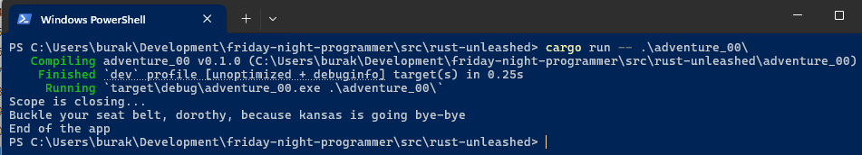

İşte şimdi beyin yakan kod parçasının tam zamanı. İkinci bir fonksiyon daha ekleyerek ortamı şenlendirelim.

```rust
#![allow(dead_code)]

struct Identity {
    value: u32,
}

impl Drop for Identity {
    fn drop(&mut self) {
        println!("Buckle your seat belt, dorothy, because kansas is going bye-bye");
    }
}
fn main() {
    // case_one();
    case_two();
    println!("End of the app");
}

fn case_one() {
    let _id = &Identity { value: 1001 };
    println!("Scope is closing...");
}

fn case_two() {
    _ = &Identity { value: 1001 };
    println!("Scope is closing...");
}
```

Bu kodun çalışma zamanı çıktısı ise aşağıdaki gibi olacaktır.

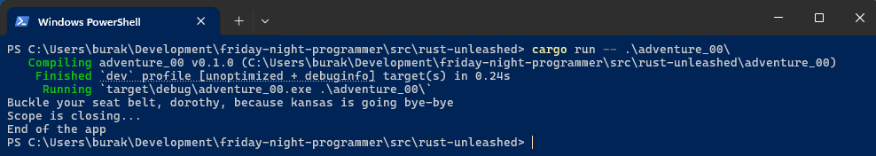

Aslında yazımsal olarak aradaki fark belli olsa da bind edilen/edilmeyen veriler söz konusu olduğu için bellek tahisi ve yaşam süreleri arasında önemli bir fark var. Peki ya nasıl bir fark? Dikkat edileceği üzere **drop** fonksiyonu **case_two** isimli blok sonlanmadan önce ve hatta **_** atamasının yapıldığı satırın hemen ardından çağırılmış görünüyor. Dolayısıyla elimizde tanımlandığı kapsam *(case_two fonksiyonunun kapsamı)* sonuna kadar yaşamamış bir değişken var. İşte burada çok temel bazı bilgileri gözden kaçırmış olduğumu fark ettim.

Aslında her iki metot özelinde düşündüğümüzde **Identity** türünden bir değer oluşturduğumuzda *(eşitliklerin sağ tarafları)* veri bellekte geçici bir alana *(temporary memory location)* alınıyor. Bunda olağanüstü bir durum var. Ta ki biz onu gerçekten kullanacağımızı belirttiğimiz bir değişkene atayıncaya kadar ki bu da **let** anahtar kelimesi ile yapılan bir atama işlemi demek. let ile yapılan atamada bu geçici bellek bölgesi aslında bir değişken ile bağlanırken *(binding)* kendi yaşam süresi de uzatılıyor. Ancak **_** atamasında değişkene bağlama işlemi kasıtlı olarak atlanmakta. Buna ignore the binding deniyor. Yani geçici bellek bölgesi bir değişkene bağlanmadığı için yaşam süresi de uzatılmıyor ve hemen ardından **drop** fonksiyonu çağrılarak bellekten düşürülüyor. Ben bir yaşıma girdim. Belki hiç önemsenmeyecek bir detay gibi görünebilir ama dile olan hakimiyetimiz açısından önemli başlıklardan birisi.

Maceralarım devam edecek :D

## Her Const Kullanımı Yeni Bir Geçici Kopya Demek mi? (adventure_01)

Değerinin değişmeyeceğini varsaydığımız türler için constant kullanmak yaygın bir alışkanlık. Zaten birçok dilde sabit değerler için böyle bir enstrüman bulunuyor. Rust tarafında constant tanımlamak için **const keyword** kullanılıyor. Constant değişkenler ilk değer ataması ile birlikte tanımlanıyor zira bellekte bu değişmez için ne kadar yer ayrılacağının baştan bilinmesi gerekiyor. Aşağıdaki kod parçasını göz önüne alalım.

```rust
const MAX_LEVEL: u32;

fn main() {

}
```

Bu kod derlenmeyecek ve aşağıdaki hata üretilecektir.

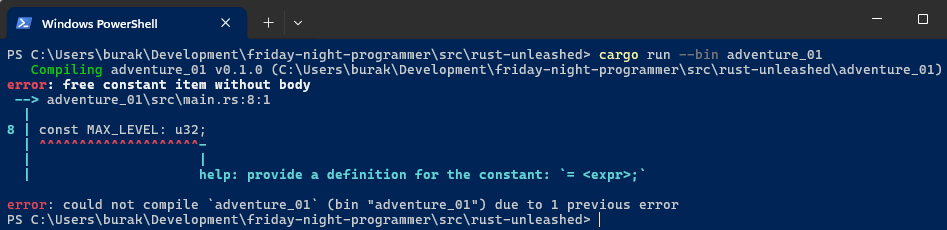

```text
error: free constant item without body
 --> adventure_01\src\main.rs:8:1
  |
8 | const MAX_LEVEL: u32;
  | ^^^^^^^^^^^^^^^^^^^^-
  |                     |
  |                     help: provide a definition for the constant: `= <expr>;`
```

Şimdi bunu cebimize koyalım. Demek ki bir **constant** tanımlanırken ilk değerinin verilmesi zorunlu. Bir **constant**, **primitive** bir tür değerini taşımak zorunda değil. Pekala kendi tasarladığımız bir veri yapısını da constant olarak tanımlayabiliriz. Hem kendi veri yapımızı kullanmak hem de farklı bir durumu değerlendirmek için aşağıdaki kod parçasını ele alalım.

```rust
#![allow(dead_code)]

struct BackgroundColor {
    name: &'static str,
    id: u32,
}

impl Drop for BackgroundColor {
    fn drop(&mut self) {
        println!("Dropping constant. State: {},{}", self.name, self.id);
    }
}

const BACKGROUND_COLOR: BackgroundColor = BackgroundColor {
    name: "Lightsaber",
    id: 1,
};

fn main() {
    let value = &mut BACKGROUND_COLOR;
    value.name = "Black pearl";
    value.id = 2;
    println!("Value Name: {} and ID: {}", value.name, value.id);

    BACKGROUND_COLOR.name = "Red wine";
    BACKGROUND_COLOR.id = 2;
    println!(
        "Background Color Name: {} and Id {}",
        BACKGROUND_COLOR.name, BACKGROUND_COLOR.id
    );
}
```

**BackgroundColor**, **statik** yaşam ömürlü literal string *(&str)* ve stack odaklı 32 bit işaretsiz tamsayı *(u32)* taşıyan bir veri yapısı. Özellikle yaşam döngüsünü izlemek istediğimiz için **Drop** trait'ini de implement ettik. Sonrasında **BACKGROUND_COLOR** isimli bir **constant** tanımlıyoruz ve buna ilk değerini verirken **name** ile **id** alanlarına da birer değer atıyoruz. main fonksiyonu içerisinde ise dikkate değer işler söz konusu. İlk olarak **constant** 'ın **mutable** bir referansını **value** isimli bir değişkene bağlıyoruz. Ardından **value** üzerinden **name** ve **id** alanlarında değişiklik yapıyoruz. Bundan herhangi bir sorun yok zira constant yeni bir temporary alan halinde yeniden oluşturulup bind ediliyor. Sonrasında **BACKGROUND_COLOR** constant'ının **name** alanını değiştiriyoruz ve tekrardan ekrana yazdırıyoruz. Öncelikle kodun çalışma zamanı çıktısını bir inceleyelim.

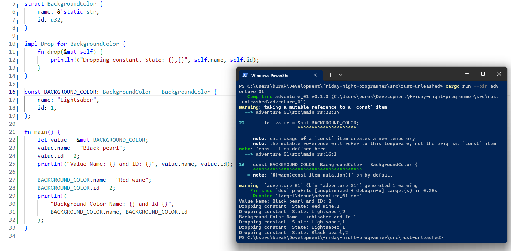

İlk dikkat etmemiz ve okumamız gereken yer uyarı mesajı.

```text
warning: taking a mutable reference to a `const` item
  --> adventure_01\src\main.rs:22:17
   |
22 |     let value = &mut BACKGROUND_COLOR;
   |                 ^^^^^^^^^^^^^^^^^^^^^
   |
   = note: each usage of a `const` item creates a new temporary
   = note: the mutable reference will refer to this temporary, not the original `const` item
note: `const` item defined here
  --> adventure_01\src\main.rs:16:1
   |
16 | const BACKGROUND_COLOR: BackgroundColor = BackgroundColor {
   | ^^^^^^^^^^^^^^^^^^^^^^^^^^^^^^^^^^^^^^^
   = note: `#[warn(const_item_mutation)]` on by default

warning: `adventure_01` (bin "adventure_01") generated 1 warning
```

Uyarı mesajı **const** bir öğeye mutable referans alındığını belirtmekte. Nitekim her **const** kullanımı yeni bir geçici alan oluşturulması demek. Örnek kodda bu yeni alan referans olsa dahi **value** isimli yepyeni bir değişkene bağlanıyor *(binding)*. Bir başka ifadeyle **const** tanımlanan bir öğe bellekte tek bir yerde durmuyor ve her kullanıldığında yeni bir kopyası oluşturuluyor. Dolayısıyla biz değiştirilebilir referans ile bu yeni kopyaya erişiyoruz. Farklı bir kopya üzerinden çalışmamızda bir sakınca yok zira aynı verinin sahipliğini taşımıyorlar. Dolayısıyla **value** üzerinden **name** ve **id** gibi alanları değiştirmemizde bir problem yok ve bu değişiklikler orjinal constant değerini de etkilemiyor. Diğer yandan kodun devam eden kısmında doğrudan **BACKGROUND_COLOR** constant değişkeni üzerinde işlemler yapıyoruz. Sırasıyla name ve id alanlarının içeriğini değiştiriyoruz. Lakin her bir atama işlemi yeni bir constant kopyasının oluşturulması ve satır sonlandığı anda *(yani ; ile ifade tamamlandığında)* da derhal **drop** edilmesi demek. Bu nedenle constant değişkeni üzerinden name ve id alanlarına müdahale etsek dahi asıl constant içeriği sabit kalmaya devam ediyor. Birden fazla constant kopyası oluşmasının ispatı da program sonunda çalıştırılan drop çağrıları ile anlaşılabiliyor.

## Zero Sized Types ve Assignment Expression ile Unit Type İlişkisi (adventure_02)

**Rust**'ın yetenekli bir dil olduğunu hepimiz biliyoruz. Detayda inanılmaz ayrıntılar içeriyor. Bunda birçok iyi dilden esinlenip adapte ettiği türlü özelliklerin önemli bir payı var. Söz gelimi fonksiyonel dil paradigmasından **Option** ve **Result** türlerini alması ya da **Haskell**'den **Type Class** kavramını alıp **Trait** enstrümanını şeklinde kullanması gibi. Bu ve başka özellikler dilin gücünü daha da artırıyor. Çok fazla söz edilmeyen bir başka güçlü kavram ise **Zero Sized Types**. Hatta şu anki kod macerasını kavrayabilmek için öncelikle sıfır boyutlu bir veri türü söz konusu olabilir mi, olursa hangi senaryolarda işe yarar bakmam gerektiğini anladım.

Zero Sized Type *(ZST)* türünden veri yapıları bellekte yer kaplamayan türler olarak ifade edilebilir. Bir başka ifadeyle bu türler bellekte sıfır byte yer kaplarlar. Nasıl yani; derlemeli bir dil kullanıyoruz, bellek yönetimi konusunda takıntılı, garbage collector olmadan bellek kaçaklarını önlediği sert kurallara sahip ve kodda tanımladığımız bir değişken için çalışma zamanında bellek tahsisi yapılmadan ilerlenbiliyor. Doğru mu anladım?  

Sanırım bu soruya Evet şeklinde cevap verebiliriz. Örneğin herhangi bir alan içermeyen bir **struct**, **unit** türü *(() ile ifade edilir)* ve bazı **enum türleri *(örneğin Empty gibi)*** ZST olarak kabul edilir. Hatta unit dönen bir ifadenin de sıfır boyutlu olduğunu söylesek yeridir. İhtiyaca göre kendi **ZST** veri yapılarımızı da tanımlayabiliriz. Bu konuda daha çok **State Machine** senaryoları örnek olarak gösteriliyor. Böyle ifade edince de aklıma gelen ilk senaryo bir oyundaki ana döngünün yönetilmesi oldu. Hatta bu senaryoda **PhantomData** kullanarak state'leri sıfır maliyetle yönetmek de mümkün diyebilirim. **PhantomData** ile işaret edilen veri türleri derleme zamanında varken çalışma zamanında yoktur dersem de kafaların iyice karışacağını tahmin ediyorum. Ancak gerçekten de böyle bir durum söz konusu. Bazen ilgili veri yapısının sadece kod tarafında kullanıldığı ama çalışma zamanında ele alınması gerekmeyen senaryolar söz konusu olabilir. Bu açıdan bakınca oyun döngüsü ne kadar iyi bir örnek tartışmaya açık. Gelin tüm bunları harmanlayıp örnek bir kod üzerinden ilerleyelim. İlk olarak şu **state machine** senaryosuna bir bakalım.

```rust
#![allow(dead_code)]

use std::marker::PhantomData;
use std::mem;

struct MenuState;
struct PlayingState;
struct PausedState;
struct GameOverState;

struct GameLoop<State = MenuState> {
    state: PhantomData<State>,
}

impl Default for GameLoop<MenuState> {
    fn default() -> Self {
        GameLoop { state: PhantomData }
    }
}

impl<State> GameLoop<State> {
    fn change<NextState>(&self) -> GameLoop<NextState> {
        GameLoop { state: PhantomData }
    }
    fn reset(&self) -> Self {
        Self { state: PhantomData }
    }
    fn get_state(&self) -> PhantomData<State> {
        self.state
    }
}

impl GameLoop<MenuState> {
    fn play(&self) -> GameLoop<PlayingState> {
        println!("Playing...");
        self.change::<PlayingState>()
    }
}

impl GameLoop<PlayingState> {
    fn pause(&self) -> GameLoop<PausedState> {
        println!("Game paused...");
        self.change::<PausedState>()
    }
    fn loose(&self) -> GameLoop<GameOverState> {
        println!("Game over...");
        self.change::<GameOverState>()
    }
}

impl GameLoop<GameOverState> {
    fn go_to_menu(&self) -> Self {
        println!("Going to menu");
        self.reset()
    }
}

impl GameLoop<PausedState> {
    fn go_on(&self) -> GameLoop<PlayingState> {
        println!("Playing...");
        self.change::<PlayingState>()
    }
}

fn main() {
    let flow = GameLoop::default().play();

    println!(
        "Size of Gameloop is {} bytes and the current state is {:?}",
        mem::size_of_val(&flow),
        flow.get_state()
    );

    let flow = flow.pause().go_on().loose().go_to_menu();
    println!(
        "Size of Gameloop is {} bytes and the current state is {:?}",
        mem::size_of_val(&flow),
        flow.get_state()
    );
}
```

Kod biraz karışık görünebilir. Şöyle bir üstünden geçelim; Oyun döngüsü için dört farklı durum söz konusu. Menüde olma hali, oyunun oynandığı durum, oynarken pause etme veya hedefi ıskalayıp yanınca oyunun sonlandığı an. Tabi ki gerçek bir oyun geliştirme ortamı için bu state'ler yeterli değil ancak amacımız burada **Zero Sized Types** kavramını anlamak. **GameLoop** isimli veri yapısındaki **state** alanını **generic PhantomData** türünden tanımladık. Dolayısıyla bu alanda kullanacağımız **MenuState**, **PlayingState**, **PausedState** ve **GameOverState** değişkenleri sadece derleme aşamasında değerlendirilen ama çalışma zamanında yer tahsisi yapılmayan bir özellik kazandı.

State türlerini ifade eden her bir **struct** için bir **GameLoop** implementasyonu söz konusu. Bu implementasyonlarda state'ler arası geçişleri sağlayan metotlar yer alıyor. Örneğin menüdeyken oyunu başlatıp **PlayingState**'e geçebiliriz veya **PlayingState** halinde iken **pause** metodu ile **PausedState**'e geçebiliriz. Geçişleri kolaylaştırmak veya başa dönmek içinse generic **GameLoop**'un kendisinde tanımlanmış **change** ve **reset** gibi metotlardan yararlanıyoruz.

Main metodunda örnek kullanımlar söz konusu. İşin enteresan kısmı kullandığımız **GameLoop** veri yapısının bu haliyle bellekte ne kadar yer kaplayacağı. Çalışma zamanı çıktısı aşağıdaki ekran görüntüsündeki gibidir. Fark ettiğiniz üzere veri yapısının boyutu **0 bytes**. Hatta bundan biraz daha emin olmak için **Player** isimli, gerçekleşen olayla hiçbir ilgisi bulunmayan bir veri yapısı da kullandık *(Bellekte ne kadar yer ayrıldığını görmek için **mem** modülünden **size_of_val** fonksiyonunu kullandık)*

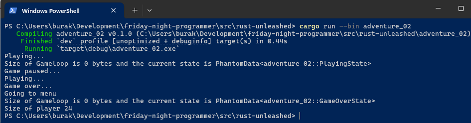

Sıfır boyutlu verileri biraz olsun anladık diye düşünüyorum. Eğer rust ile geliştirmekte olduğunuz projede PhantomData ve ZST kullanımına geçeceğiniz vakalar buluyorsanız dilde epey uzmanlaşmışsınızdır diyebilirim ama tabii ilerleyen maceralar aksini de söyleyebiliri. Neyse neyse... Benzer varlıklardan birisi de ki **()** ile ifade ediliyor **unit** türü. Şimdi bunu da cebimize koyalım ve aşağıdaki kod parçasını göz önüne alalım.

```rust
use std::mem;

fn main() {
    let value_x;
    let value_y = value_x = 23;
    println!("Value X :{}", value_x);
    println!(
        "Value Y : {:?} Size of the value {}",
        value_y,
        mem::size_of_val(&value_y)
    );
}
```

Öncelikle kodun çalışma zamanı çıktısına bir bakalım.


Dikkat edileceği üzere **value_y**' nin değeri standart bir placeholder ile değil **{:?}** ile alınabilmektedir zira bu türden atama ifadelerinin *(assignment expression)* dönüşü birim (unit) tiptir. Unit tipler de sıfır boyutlu veri türlerindendir. Dolayısıyla **value_y** değişkenine belirtilen ifadeye göre **()** atanmış ve boyutu otomatik olarak sıfır olmuştur. Böylece **assignment expression** kavramını ne kadar iyi bildiğimizi de sorgulama fırsatı bulmuş olduk. Kafasından duman çıkmayan beri gelsin :D

## let-binding Senaryolarında Yaşam Süreleri (adventure_03)

Tanımladığımız değişkenler çeşitli kurallara göre hayatta kalıyorlar. En belirgin ölçü kapsam *(scope)* dışına çıkılması. Genellikle süslü parantezler ile belirlenen alanlar kullanılan değişkenlerin yaşadığı kapsamları ifade ediyor. Elbette verileri kapsamlar arasında kopyalama veya referans yoluyla taşımak mümkün. Ancak hangi teknik olursa olsun sonuçta verilerin ve onları işaret eden değişkenlerin derleyici tarafından bilinen bir yaşam ömrü *(lifetime)* var. Birçok veri türü ile çalışırken kapsamlara çok fazla da aldırış etmeden kodlama yapabiliyoruz. Referans türlerine gelindiğinde ise **lifetime annotation**'lar ile daha karmaşık bir dünyaya geçiyoruz. Bazı senaryolarda kendi veri yapılarımızı tasarlayarak kullanıyoruz ve hatta **container** görevi gören veri yapıları da kullanıyoruz. İşte bu örnek kod parçasında geliştirici tarafından tanımlanmış bir veri yapısını içeren başka bir veri yapısını ele alıyoruz. Amacımız kapsam sonlandığı noktada özellikle iç veri yapısında **drop** mekanizmasının bazı hallerde farklı davranış sergileyebileceğini kanıtlamak. Özellikle de **let** ile yapılan veri atamalarında *(let binding)* anında **drop** operasyonuna neden olabilecek bir durumu yakalamaya çalışacağız. İlk olarak aşağıdaki başlangıç kodlarını ele alalım.

```rust
#![allow(dead_code)]

fn main() {
    scenario_1();
    println!("End of the programme");
}

fn scenario_1() {
    let dotenv = Process {
        id: ProcessId(1903),
        is_active: false,
        name: "Dot Net Environment".to_string(),
    };
    print_process(&dotenv);
}

fn print_process(process: &Process) {
    println!("{:?}", process);
}

#[derive(Debug)]
struct ProcessId(u16);

impl Drop for ProcessId {
    fn drop(&mut self) {
        println!("Droping process id {}", self.0);
    }
}

#[derive(Debug)]
struct Process {
    id: ProcessId,
    is_active: bool,
    name: String,
}

impl Drop for Process {
    fn drop(&mut self) {
        println!("Droping process {}", self.name);
    }
}
```

**Process** isimli veri yapısı, **bool**, **String** ve yine kendi tasarladığımız **ProcessId** türünden birer alan içeriyor. Sistemde çalışan process'leri ifade eden çok ilkel bir veri yapısı olarak tasarladığımızı varsayabilirsiniz. Her iki veri yapısı için kapsam dışına çıktığımız noktaları gözlememek adına **Drop** trait'inin uyguluyoruz. **scenario_1** isimli fonksiyonda çok basit olarak bir **Process** değişkeni tanımlıyor ve ekrana yazdırıyoruz. dotenv isimli **Process** türünden olan değişkenimiz tahmin edileceği üzere bu fonksiyon içinde tanımlı ve dolayısıyla fonksiyon sonlandığında drop edilmesi gerekiyor ki bu noktada hemen arkasından **ProcessId** veri yapısı da drop ediliyor. Çalışma zamanı çıktısına göre drop edilme sırası **Process -> ProcessId** şeklinde görünüyor.

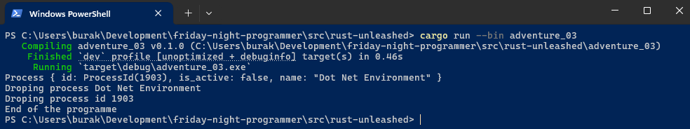

Şimdi aynı veri yapılarını tamamen farklı bir senaryoda ele alacağız. Bunun için aşağıdaki kod parçasını ele alabiliriz.

```rust
#![allow(dead_code)]

fn main() {
    scenario_2();
    println!("{}", "*".repeat(20));
    scenario_3();
}

fn scenario_2() {
    let Process { name, .. } = Process {
        id: ProcessId(1905),
        is_active: false,
        name: "Docker Compose".to_string(),
    };
    println!("{:?}", name);
}

fn scenario_3() {
    let Process { ref name, .. } = Process {
        id: ProcessId(1905),
        is_active: false,
        name: "Docker Compose".to_string(),
    };
    println!("{:?}", name);
}

#[derive(Debug)]
struct ProcessId(u16);

impl Drop for ProcessId {
    fn drop(&mut self) {
        println!("Droping process id {}", self.0);
    }
}

#[derive(Debug)]
struct Process {
    id: ProcessId,
    is_active: bool,
    name: String,
}
```

Önceki senaryodan tamamen farklı yazılan bu örnekte **Process** değerini oluştururken içerdiği **name** alanını **let-binding** ile dışarıya alıyoruz. Eşitliğin sol tarafında kullandığımız **..** operatörü **... ve geri kalanları** anlamına geliyor. Dolayısıyla oluşturulan Process içerisindeki **name** alanını dışarıya alıyor ve sonrasında da ekrana bastırıyoruz. Bu çalışmada önemli olan mevzu **ref keyword** kullanımının her iki vakada oluşturduğu fark. Bunu daha iyi yorumlayabilmek amacıyla çalışma zamanı çıktısına bakalım.

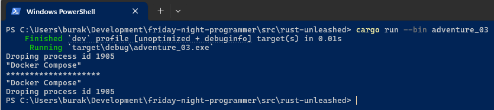

İlk çağrıda dikkat edileceği üzere önce **ProcesId** veri yapısının **Drop** metodunun, Process veri yapısından dışarıya aldığımız **name** alanının ekrana yazılmasından önce çağırıldığı görülüypr. Birbaşka deyişle eşitliğin sağ tarafında, Process tanımında oluşturduğumuz **ProcessId** alanı anında drop ediliyor. Bu oldukça mantıklı zira dışarıya aldığımız değişken sadece **name** alanı ve o da kuvvetle muhtemel klonlanarak akışta devam ediyor. Ancak scenario_2 fonksiyonunda farklı bir uygulama şekli söz konusu. Burada **ref** anahtar kelimesini kullanıyor. Bu durumda **name** alanı bir referans üzerinden ödünç alınıyor ve buna göre de **Process** verisinin scope sonuna kadar yaşaması gerekiyor. Bir scope içinde sahip olduğu alanlardan herhangi birini referans eden bir başka değişkenin halen daha yaşadığı ama kendisi drop edilmiş bir değişken barındıramayız, bu tabiri caizse Ronin olur. ref kullanılan senaryoda bu sebeple **name** alanı ilk olarak ekrana yazdırılmış ve ardından **ProcessId** drop edilebilmiştir.

Burada bir noktaya açıklık getirmemiz gerekiyor. Son örnekte **Process** veri yapısına ait **drop** uygulaması kaldırıldı. Eğer kullanmak istersek aşağıdaki ekran görüntüsünde olduğu gibi bir derleme zamanı hatası alırız.

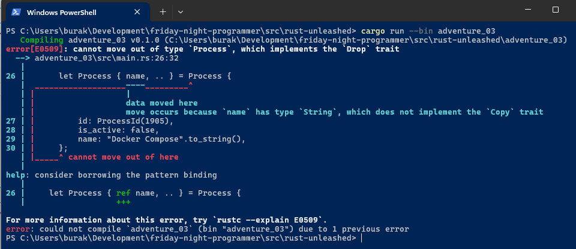

```text
error[E0509]: cannot move out of type `Process`, which implements the `Drop` trait
  --> adventure_03\src\main.rs:26:32
   |
26 |       let Process { name, .. } = Process {
   |  ___________________----_________^
   | |                   |
   | |                   data moved here
   | |                   move occurs because `name` has type `String`, which does not implement the `Copy` trait
27 | |         id: ProcessId(1905),
28 | |         is_active: false,
29 | |         name: "Docker Compose".to_string(),
30 | |     };
   | |_____^ cannot move out of here
   |
help: consider borrowing the pattern binding
   |
26 |     let Process { ref name, .. } = Process {
   |                   +++

For more information about this error, try `rustc --explain E0509`.
```

Bu hata mesajı son derece anlamlıdır. Zira eşitliğin sağ tarafındaki **Process** tanımında yer alan **name** alanını dışarıya almak istediğimiz ama Process'in kendisinin Drop edilmeye çalışıldığı bir durum söz konusudur. Bu nedenle derleyici **bind** işlemi sırasında **name** alanını **ref** ile ödünç almayı önerir.

## Birden Fazla Mutable Referansta Israr Etmek (adventure_04)

Rust derleme zamanı kuralları gereği aynı anda birden fazla **mutable** referansa sahip olmak mümkün değildir. İstediğimiz kadar immutable referans ataması yapabilsek te t anında sadece tek bir mutable referans olması istenir. Aynı veriyi referans edenlerin bu veriyi değiştirebiliyor olması verinin tutarlığı için bir sorundur. Genellikle **Data Races** olarak da bildiğimiz bu durum Rust'ı öğrenmeye başladığımızda sıklıkla da karşımıza çıkar. Ancak ısrarcı olabilir ve kuralı ihlal edebilirsiniz. Başlamadan önce ihlal durumunu aşağıdaki kod parçası ile kısaca hatırlamaya çalışalım.

```rust
fn main() {
    let mut jump = Jump { value: 100 };

    let ref_1 = &mut jump;
    let ref_2 = &mut jump;
}

struct Jump {
    value: u32,
}
```

**Jump** isimli veri yapısından tanımladığımız değişken için iki adet **mutable** referans tanımı var. Kodu bu şekilde derlediğimizde herhangi bir sorunla karşılaşmayız. Sorun bu **ref_1** üzerinden veriyi değiştirmek istediğimizde oluşur. Tek bir satır ile derleme zamanı hatasını kolayca alabiliriz.

```rust
fn main() {
    let mut jump = Jump { value: 100 };

    let ref_1 = &mut jump;
    let ref_2 = &mut jump;

    (*ref_1).value = 90;
}

struct Jump {
    value: u32,
}
```

**ref_1** referansı üzerinden **value** değerine ulaşıp değiştirme istedik. Ancak aynı veriyi **mutable** olarak referans etmekte olan bir başkası var *(ref_2)*. Bu nedenle rust derleyicisi aşağıdaki tepkiyi verecektir.

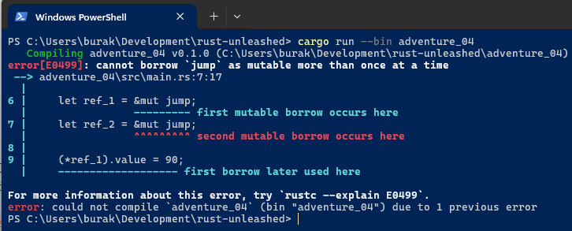

Fakat istersek **Neo** gibi kuralları esnetebiliriz *(Morpehus'un da dediği gibi; Do you think that's air you're breathing now?)* Şöyle ki; **raw pointer**'lara ait referansları dışarıya çıkartıp **unsafe** bölgede kullanabilir ve **Data Race** ihlalini göz ardı edebiliriz. Aynı kodu aşağıdaki gibi değiştirelim.

```rust
fn main() {
    let mut jump = Jump { value: 100 };

    let ref_1 = &mut jump as *mut Jump;
    let ref_2 = &mut jump as *mut Jump;

    unsafe {
        println!("ref 1 address: {:?}, ref 2 address: {:?}", ref_1, ref_2);
        (*ref_2).value = 90;
        (*ref_1).value = 75;
        println!(
            "ref_1.value: {}, ref_2.value: {}",
            (*ref_1).value,
            (*ref_2).value
        );
    }
}

struct Jump {
    value: u32,
}
```

**ref_1** ve **ref_2** referanslarını yine **mutable** olarak ele alırken bu sefer **raw pointer**'lara dönüştürüyoruz. Bu tamamen güvensiz bir yaklaşım zira kodu **unsafe** blok kullanmadan derlersek **error[E0133]: dereference of raw pointer is unsafe and requires unsafe block** hatası ile karşılaşırız. Dolayısıya * operatörü ile pointer referansları üzerinden veriye erişmek istediğimizi derleyiciye açıkça ifade etmemiz bekleniyor. Yani riskleri kasıtlı olarak göze aldığımızı açıkça söylemeliyiz. Koddaki her iki referansta aynı veri bölgesini işaret ettiğinden doğal olarak birisi üzerinden yapılacak veri değişikliği diğerine de yansıyor ve dolayısıyla en son kim değiştirdiyse yarışı o kazanıyor. Kodun çalışma zamanı çıktısı aşağıdaki gibidir.

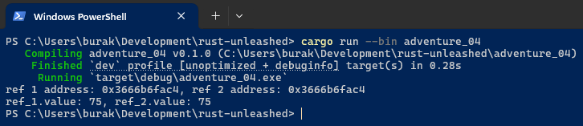

Şimdi olayı farklı bir boyuta taşıyalım. İşin içerisine bize hep sürprizler yapan sıfır boyutlu veri yapılarını *(Zero Sized Types)* katalım.

```rust
fn main() {
    let [j1, j2] = &mut [Jump { value: 100 }, Jump { value: 50 }];

    let j1 = j1 as *mut Jump;
    let j2: *mut Jump = j2 as *mut Jump;

    println!("Size of Jump Array is {}", std::mem::size_of::<[Jump; 2]>());
    println!("Size of Jump struct is {}", std::mem::size_of::<Jump>());
    println!("j1 address: {:?}, j2 address: {:?}", j1, j2);

    let [e1, e2] = &mut [Entity, Entity];

    let e1 = e1 as *mut Entity;
    let e2 = e2 as *mut Entity;

    println!();
    println!(
        "Size of Entity Array is {}",
        std::mem::size_of::<[Entity; 2]>()
    );
    println!("Size of Entity struct is {}", std::mem::size_of::<Entity>());
    println!("e1 address: {:?}, e2 address: {:?}", e1, e2);
}

struct Entity;

struct Jump {
    value: u32,
}
```

Örnek kodda, **Jump** ve **Entity** türlerinden birer array kullanıyoruz. Dizi değerleri yine mutable referanslar olarak değişkenlere alınıyor. Daha önceden de bahsettiğimiz gibi **ZST** türleri derleme zamanına ait türler ve çalışma zamanı için bir anlam ifade etmiyorlar. Tanımladığımız **Entity** yapısı da böyle bir tür ve içerisinde değiştirilebilir hiçbir veri taşımıyor. Buna göre oluşturulan dizinin başlangıç adresi neresi ise **e1** ve **e2** referansları için de aynı adres kullanılıyor. Oysa ki **Jump** türünden değişkenlerin yer aldığı dizi içinden çektiğimiz referansların adresleri birbirlerinden farklı. Array dizilimine göre **u32** boyutu kadar ötelenmiş birer adres olduğunu söyleyebiliriz ki örneği çalıştırdığımız zaman elde ettiğimi adresler arasındaki fark, **0x40c6cff72c - 0x40c6cff728 = 0x4** yani **4 byte**'tır. Zira **u32** türü **4** byte yer kaplar ve **Jump** isimli struct içerisinde sadece bu veri türünü kullanıyoruz. Kodun çalışma zamanı çıktısı aşağıdaki gibidir.

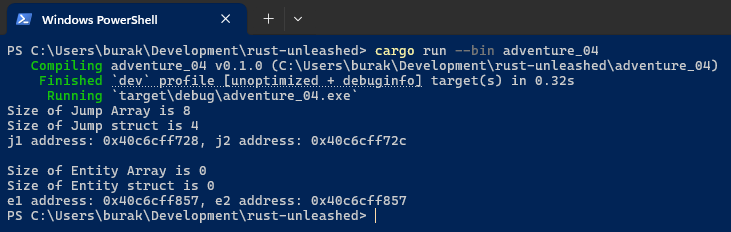

Aslında **Zero Sized Type** formuna uyan veri yapılarının kullanıldığı senaryolarda sahiplik kurallarını ihlal etmeden birden fazla mutable referansın söz konusu olabileceğini ifade etsek yeridir lakin mutable olma hali veriyi değiştirmek istediğimiz zaman anlam kazanır. Herhangi bir veri içermeyen bir yapıyı neden mutable referans olarak kullanmak isteyelim ki?

## Kaynaklar

- [Resmi Rust Kitabı](https://doc.rust-lang.org/reference/introduction.html)
